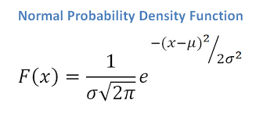
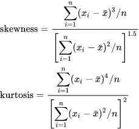
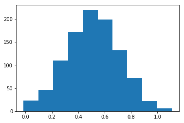
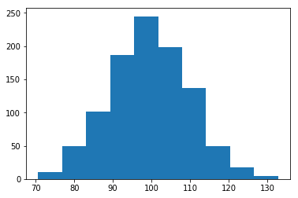
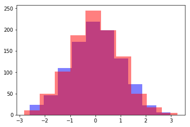

### Questions
* what is e? 
* why are these equations the way they are?

### Objectives
YWBAT
* describe when to use statistical distributions
    * look at possible outcomes of situations regarding our data
    * identifying outliers
    * get familiar with the data
    * visualizing is really powerful
* define the parameters for each statistical distribution
    * Normal Distributions
        * parameters
            * mean ($\mu$)
            * standard deviation ($\sigma$)
        * use cases
            * almost always
            * when measuring some sort of thing on a population
    * Binomial Distributions
        * parameters
            * n -> number of outcomes (gaming)
            * p -> probability of winning
        * use cases
            * the probability of an event happening k number of times in n number of trials where p is the probability of the event happening in one trial. 
    * Uniform distribution
        * parameter(s)
            * probability of a single event
        * use case 
            * great starting point for finding optimal distributions on data
    * Poisson distribution
        * parameter
            * lambda ($\lambda$) - rate an event occurs over some interval (usually time)
        * use case
            * time series
            * rates of occurences
    * Exponential distribution
        * parameters
            * lambda ($\lambda$)
        * use cases
            * rates of decay or growth
            * GDP growth or decay over time can be described by lambda
            * stock values
            * populations
        
* describe PMF and CDF
* describe the area under a distribution curve
* interpret the normal density function and standard density equation (zscores)

Things you need to know!!!
- What a parameter is and how it affects a distribution
- use cases

### Intepreting equations



decay based on distance from mean





```python
import numpy as np

import matplotlib.pyplot as plt
```


```python
x = np.random.normal(0.5, 0.2, 1000)
```


```python
def npdf(x):
    coeff = 1./(x.std() * np.sqrt(2*np.pi))
    exp = -((x - x.mean())**2)/(2*(x.std()**2))
    return coeff * np.exp(exp)
```


```python
y = np.random.normal(100, 10, 1000)
```


```python
plt.hist(x)
```


    (array([ 23.,  46., 110., 171., 219., 199., 132.,  72.,  22.,   6.]),
     array([-0.01485968,  0.09748095,  0.20982159,  0.32216222,  0.43450285,
             0.54684349,  0.65918412,  0.77152475,  0.88386539,  0.99620602,
             1.10854665]),
     <a list of 10 Patch objects>)





```python
plt.hist(y)
```


    (array([ 10.,  50., 101., 187., 245., 198., 137.,  50.,  18.,   4.]),
     array([ 70.65140712,  76.8695152 ,  83.08762327,  89.30573135,
             95.52383942, 101.7419475 , 107.96005557, 114.17816365,
            120.39627172, 126.6143798 , 132.83248787]),
     <a list of 10 Patch objects>)





```python
def zscore(x):
    return (x - x.mean())/x.std()
```


```python
z_x = zscore(x)
z_y = zscore(y)
```


```python
plt.hist(z_x, color='b', alpha=0.5)
plt.hist(z_y, color='r', alpha=0.5)
plt.show()
```




